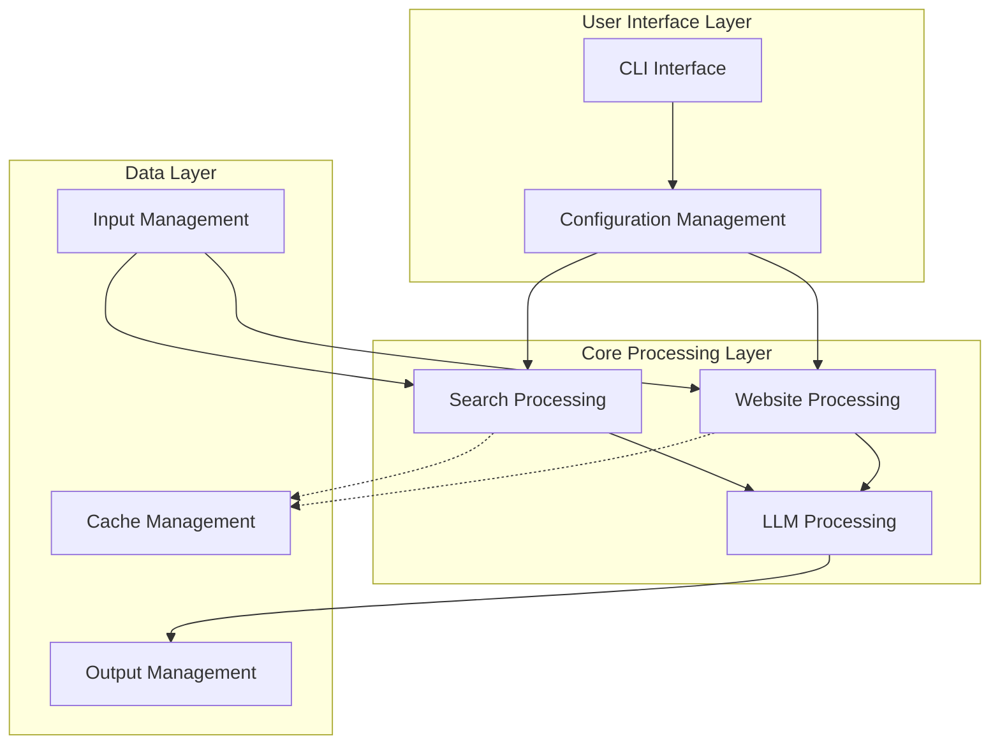
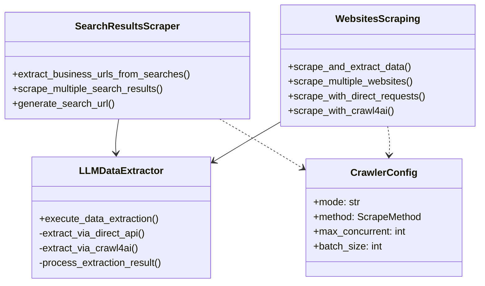
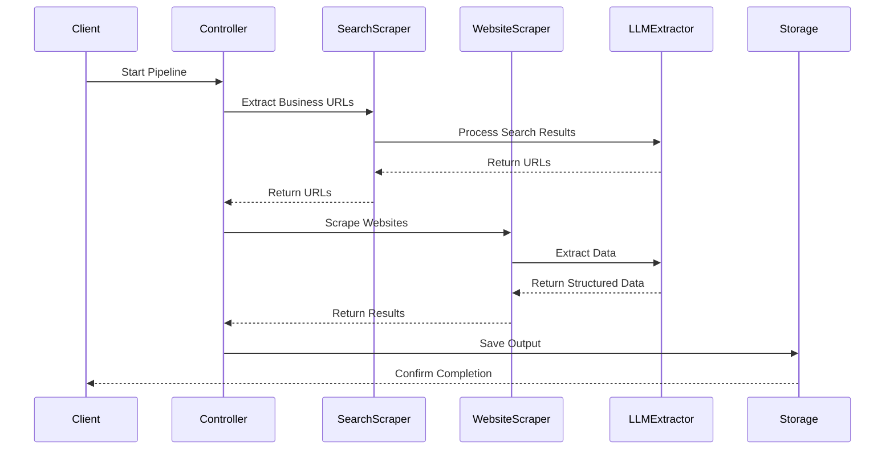
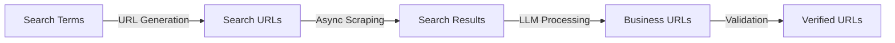
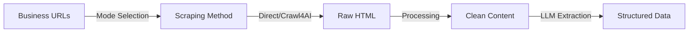
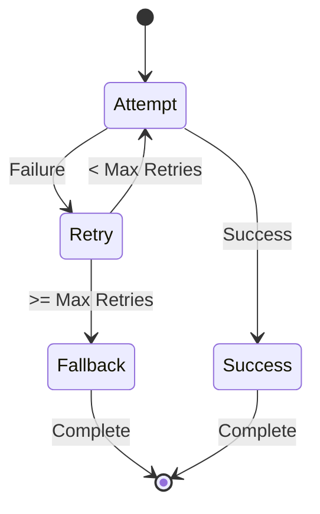

# AI-Powered Business Data Crawler - Technical Documentation

## Table of Contents
- [AI-Powered Business Data Crawler - Technical Documentation](#ai-powered-business-data-crawler---technical-documentation)
  - [Table of Contents](#table-of-contents)
  - [1. Introduction](#1-introduction)
    - [1.1 Purpose](#11-purpose)
    - [1.2 Audience](#12-audience)
  - [System Overview](#system-overview)
    - [2.1 High-Level Architecture](#21-high-level-architecture)
  - [Core Architecture](#core-architecture)
    - [Component Structure](#component-structure)
    - [Processing Pipeline](#processing-pipeline)
  - [Component Details](#component-details)
    - [1. Main Controller (`main.py`)](#1-main-controller-mainpy)
    - [2. Search Processing (`searches_scraping.py`)](#2-search-processing-searches_scrapingpy)
    - [3. Website Processing (`websites_scraping.py`)](#3-website-processing-websites_scrapingpy)
    - [4. LLM Processing (`llm_data_extraction.py`)](#4-llm-processing-llm_data_extractionpy)
  - [Data Flow](#data-flow)
    - [1. Search Flow](#1-search-flow)
    - [2. Website Flow](#2-website-flow)
  - [Integration Patterns](#integration-patterns)
    - [1. Async Processing Model](#1-async-processing-model)
    - [2. Error Handling](#2-error-handling)
  - [Performance Optimizations](#performance-optimizations)
  - [Extension Points](#extension-points)
    - [1. New Scraping Methods](#1-new-scraping-methods)
    - [2. Custom LLM Integration](#2-custom-llm-integration)
    - [3. New Data Schemas](#3-new-data-schemas)
  - [Error Handling \& Recovery](#error-handling--recovery)
    - [1. Retry Mechanism](#1-retry-mechanism)
    - [2. Error Types \& Recovery](#2-error-types--recovery)
  - [Performance Considerations](#performance-considerations)

## 1. Introduction

### 1.1 Purpose
This document provides a comprehensive technical overview of the AI-Powered Business Data Crawler. It aims to explain the system's architecture, components, data flow, and key technical concepts. The document is structured to cater to different audiences, from software architects and developers to product managers and beginners.

### 1.2 Audience
* **Software Architects:** To understand the overall system design, component interactions, and scaling considerations.
* **Software Developers:** To understand the codebase structure, key modules, development workflow, and extension points.
* **Product Managers:** To understand the system's capabilities, configuration options, and potential use cases.
* **Beginners:** To get a foundational understanding of how the system works and how to use it.

## System Overview

The AI-Powered Business Data Crawler is designed as a flexible, modular, and asynchronous data extraction pipeline. It automates the process of discovering and extracting structured business information from websites, leveraging large language models (LLMs) for intelligent data extraction.

### 2.1 High-Level Architecture

The system is structured into several logical layers and key subsystems:



## Core Architecture

### Component Structure



### Processing Pipeline



## Component Details

### 1. Main Controller (`main.py`)
- Entry point and orchestration
- Command-line interface
- Configuration management
- Pipeline execution control

### 2. Search Processing (`searches_scraping.py`)
- Handles search term processing
- URL generation and validation
- Search results scraping
- URL extraction configuration

### 3. Website Processing (`websites_scraping.py`)
- Multi-mode website scraping
- HTML content processing
- Concurrent request handling
- Data cleaning and normalization

### 4. LLM Processing (`llm_data_extraction.py`)
- AI-powered data extraction
- Schema validation
- Error recovery
- Batch processing optimization

## Data Flow

### 1. Search Flow


### 2. Website Flow


## Integration Patterns

### 1. Async Processing Model
```python
async def scrape_and_extract_data(self):
    # Phase 1: Website Scraping
    scraped_data = await self.scrape_multiple_websites()
    
    # Phase 2: LLM Extraction
    llm_extractor = create_website_extractor(
        input_data_list=scraped_data,
        extraction_config=self.config.extraction_config
    )
    
    return await llm_extractor.execute_data_extraction()
```

### 2. Error Handling
```python
async def _process_extraction_batch(self, data_batch, extraction_method):
    async def process_item(data_item):
        if extraction_method == 'crawl4ai':
            result = await self._extract_via_crawl4ai(data_item)
            if self._is_successful(result):
                return result
            return await self._extract_via_direct_api(str(data_item))
        # Direct method with fallback
        result = await self._extract_via_direct_api(str(data_item))
        if self._is_successful(result):
            return result
        return await self._extract_via_crawl4ai(data_item)
```

## Performance Optimizations

1. **Concurrent Processing**
   - Configurable batch sizes
   - Async request handling
   - Smart rate limiting

2. **Smart Caching**
   - HTML content caching
   - LLM result caching
   - Search result caching

3. **Resource Management**
   - Connection pooling
   - Memory optimization
   - Request throttling

## Extension Points

### 1. New Scraping Methods
```python
class CustomScraper(WebsitesScraping):
    async def scrape_with_custom_method(self):
        # Implement custom scraping logic
        pass
```

### 2. Custom LLM Integration
```python
class CustomLLMExtractor(LLMDataExtractor):
    async def _extract_via_custom_method(self, content):
        # Implement custom LLM extraction
        pass
```

### 3. New Data Schemas
```python
class CustomExtractionResult(BaseModel):
    # Define custom schema
    pass
```

## Error Handling & Recovery

### 1. Retry Mechanism


### 2. Error Types & Recovery
- Network errors: Automatic retry with exponential backoff
- Validation errors: Fallback to alternative extraction
- Rate limiting: Smart throttling and delay
- Parsing errors: Content cleanup and retry

## Performance Considerations

1. **Concurrency Settings**
   - Default: 3-5 concurrent requests
   - Batch size: 5-10 items
   - Retry attempts: 2-3 times

2. **Resource Usage**
   - Memory: ~100MB base + ~10MB per concurrent request
   - CPU: Moderate usage during LLM processing
   - Network: ~100KB per website + API overhead

3. **Optimization Tips**
   - Increase batch_size for more throughput
   - Adjust concurrent_requests based on memory
   - Enable caching for repeated operations

---

This documentation is automatically generated and maintained. Last updated: June 1, 2025.
